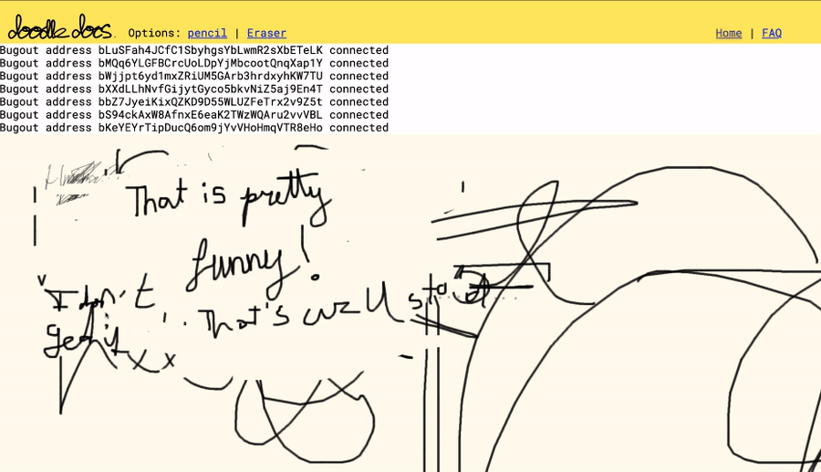

# Doodledocs

A collaborative drawing app for whatever you want. It (kind of) supports:
1. Pressure sensitivity with the Apple pencil (and probably Wacom and MS Surface as well, but it's untested).
2. P2P data transfer of the drawings

## Awesome! Where can I try this?
<a href="https://melvinroest.github.io/doodledocs" target="_blank">Demo</a> (note: you're all on the same channel)

## Dev Details

It is build with EmberjS with RoR in mind. The RoR is a simple websocket api that is another project (not online yet).
To counter scalability issues, I added a P2P layer on top of it, built with a modified version of <a href="https://github.com/chr15m/bugout" target="_blank">Bugout</a>.
The drawing algorithm is a good ol' classic, and a courtesy of <a href="https://en.wikipedia.org/wiki/Bresenham%27s_line_algorithm" target="_blank">Mr. Bresenham</a>.
